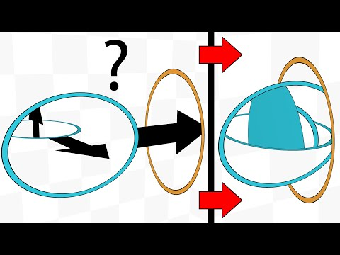

+++
title = "Оптимизация скорости статического сайта"
date = 2021-08-30T00:00:01+00:00
description = "Раньше мой блог загружался очень долго и сильно тормозил, несмотря на то что являлся статическим сайтом. Рассказываю как я добился максимальной скорости загрузки, минимального потребления трафика и 100 баллов в Lighthouse."

[taxonomies]
tags = ["мета", "блог", "оптимизация", "zola"]

[extra]
image = "preview.png"
tg = "https://t.me/optozorax_dev/503"
tg_comments = 18
+++

<style>
.speed-bad { color: #ff4e41; } /* 0-49 */
.speed-avg { color: #ffa400; } /* 50-89 */
.speed-good { color: #0dce6b; } /* 90-100 */
</style>

# Введение

Мир софта очевидно работает не так эффективно как мог бы: 
* приложения на телефон весят всё больше и больше,
* потребляемый трафик и потребляемые мощности постоянно раздуваются без видимой на то причины,
* [Electron](https://www.electronjs.org/).

Некоторые люди воспринимают это слишком близко к сердцу и начинают бороться за быстрый софт: 
* Пользуются и популяризируют протокол [Gemini](https://gemini.circumlunar.space/).
* Отключают JS на некоторых сайтах, требуют чтобы сайты работали без JS.
* Используют легковесные альтернативы, например: 
	* [Nitter](https://nitter.net/optozorax) — альтернативный фронтенд Twitter.
	* [yewtu.be](https://yewtu.be/channel/UCIsVwdLhYrrs3K8MOXEZdhQ) (на [Invidious](https://github.com/iv-org/invidious)) — альтернативный фронтенд YouTube.
	* [Bibliogram](https://bibliogram.art/) — альтернативный фронтенд Instagram.
	* И вообще целый список таких есть: [alternative-front-ends](https://github.com/mendel5/alternative-front-ends).

И я их понимаю и даже поддерживаю, но не фанатично. Я тоже против раздутого веба, но считаю что некоторые вещи допустимо оверхэдить, например картинки и видео, которые отрицаются Gemini. Я люблю когда в статьях есть много иллюстраций, с ними читать намного приятней и наглядней.

Поэтому мои оптимизации будут направлены в первую очередь против раздутости, но не дойдут до того что я выпилю все картинки или видео с сайта.

Если вам интересны какие другие фичи есть в моём блоге, кроме описанных в данной статье, то можете прочитать статью [Новые фичи данного блога](/p/new-features).

## Почему я решил заняться оптимизацией

Когда я начал переводить свой блог на [Zola](https://www.getzola.org/) (далее «зола»), я столкнулся не только с возможностью добавить кучу крутых новых фич, но ещё и с возможностью оптимизаций: оказывается в золе можно автоматически ресайзить картинки. Потянул за эту ниточку и аппетиты сильно возросли. То есть у меня и раньше были причины это сделать, но конкретным поводом стала именно возможность в золе.

# Инструменты

Для определения того насколько быстро мой сайт загружается и работает я использую:
* Здравый смысл.
* Вкладки Console, Network в инструментах разработчика.
* [PageSpeed Insights](https://developers.google.com/speed/pagespeed/insights/).

Последний инструмент анализирует вашу страницу для мобилок и декстопов, заодно предлагая все возможные пути улучшения производительности. Я предпочитаю именно веб-версию, а не Lighthouse встроенный в Chrome, чтобы сразу тестировать в продакшен условиях.

# Оптимизация внутренних запросов

## Оптимизация картинок

В золе есть возможность вызывать функцию [`resize_image`](https://www.getzola.org/documentation/content/image-processing/), которая способна перекодировать передаваемую картинку в другое разрешение, другой формат и с уменьшением качества. Я стал использовать это в своих статьях:
* Уменьшаю до максимального размера 1280×1280
* Формат `webp`
* Качество `75/100`

Выбрал именно `webp`, потому что это более современный формат, созданный специально для веба, он сжимает лучше `jpg`, и не такой шакалистый. Ещё он поддерживает прозрачность, благодаря чему можно смело конвертировать `png` в него. Правда он [не везде поддерживается](https://caniuse.com/webp), но думаю можно пережить(?).

{{ admonition_start(color="violet", title="Использование в Zola") }}
В статьях я вставляю картинки в markdown не через ``, а через шорткод `image.html`:
```zola
{{/* image(path="my_image.jpg") */}}
```
{{ admonition_end() }}

Пример изменений в размерах:

|Комментарий|Прошлый формат|Прошлое разрешение / 1280|Прошлый размер|Новый размер|Пожато в N раз|
|-|-|-|-|-|-|
|Фотография моей клавитуры|jpg|×1.3|533кб|39кб|×13.7|
|Картинка самого сложного слоя моей раскладки|png|×2.3|333кб|27кб|×12.3|
|Скриншот монопортала|png|×1.4|314кб|34кб|×9.2|
|Фотография клавиатуры Planck|jpg|×1|47кб|25кб|×1.9|
|Фотография улицы|jpg|×1|219кб|239кб|×0.9|

Общий тренд видно: для больших картинок, которые больше 1280, экономия трафик колоссальна. Для `png` картинок тоже отлично получается. Иногда проходит не очень хорошо, как с фотографией улицы, но это редкость и не критично. И это всё для не очень критичных изменений в качестве.

Любую картинку можно открыть в оригинальном размере и оригинальном формате если хочется увидеть больше деталей. Подробнее об этом в моей статье [про новые фичи блога](/p/new-features).

{{ admonition_start(color="green2", title="Результат") }}
У меня в папках лежит 50мб `jpg` и `png` картинок, а обработанный результат в формате `webp` весит 11мб.

Итого экономия в **≈5 раз**!
{{ admonition_end() }}

{{ admonition_start(color="blue2", title="Кстати, ") }}
на главной странице у каждой статьи сбоку есть картинка, чтобы не одними заголовками привлекать внимание. 

Раньше для этих маленьких картинок запрашивалось картинка в оригинальном огромном разрешении, поэтому главная страница могла загружаться долго и весить реально много.

Сейчас же, с этой фичей оптимизаций картинок, специально для главной я ресайзю картинки до максимального разрешения 200×200, и теперь главная даже со всеми картинками загружается моментально.

Без этой фичи в золе я бы точно не стал так заморачиваться с маленькими картинками.
{{ admonition_end() }}

## Оптимизация видео

В HTML5 есть тэг `<video>` в который можно вставлять проигрывание видео без всяких хаков и JS. Через него я иногда вставляю видео в своих статьях.

Видео тоже не должны иметь слишком большое разрешение. Например, на телефоне вы снимаете в 4к, зачем это качество иметь у себя на странице и зря нагружать трафик? Тем более если видео маленькое, демонстративное.

Ещё видео надо особым образом кодировать, чтобы оно воспроизводилось во всех браузерах и устройствах.

Я преобразую видео через [`ffmpeg`](https://www.ffmpeg.org/) следующим скриптом:

```bash
#!/bin/bash

# First argument: input file (may be another video, gif or folder with pictures,
# read ffmpeg docs).
#
# Second argument optional: quality. for default it is 35 (averagely bad 
# quality), you can provide 22 as nice quality.
#
# Third argument optional: can be "mute" to mute or anything else to not to.
#
# Out is file with `_web` postfix and `mp4` format scaled down to 1280 max 
# width or height or not scaled if initial size is smaller
# 
# Command get from https://gist.github.com/jaydenseric/220c785d6289bcfd7366

filename=$(basename -- "$1")
extension="${filename##*.}"
filename="${filename%.*}"
path="${1%/*}"

if [ ${3:-"preserve_audio"} == "mute" ]
then
	audio="-an"
else
	audio="-c:a aac -strict experimental"
fi

ffmpeg -y \
       -i $1 \
       -c:v libx264 \
       -pix_fmt yuv420p \
       -profile:v baseline \
       -level 3.0 \
       -crf ${2:-35} \
       -preset veryslow \
       -vf "scale=ceil(iw*min(1\,1280/iw)/2)*2:ceil(ow/dar/2)*2" \
       ${audio} \
       -movflags +faststart \
       -threads 0 \
       ${path}/${filename}_web.mp4
```

Аргументы и его источник написаны в комментариях к скрипту, так что пользуйтесь наздоровье. Итоговое видео оптмизировано для работы в браузере, а так же работает и с телефона. Наивный `mp4` просто так на телефоне не запустится.

{{ admonition_start(color="green2", title="Результат") }}
Тут без конкретных замеров, но знайте что экономия тоже большая, а самое главное — видео будут запускаться везде.
{{ admonition_end() }}

{{ admonition_start(color="orange", title="Дополнительная информация") }}
Есть ещё возможность конвертировать видео в кодек AV1, ибо он современней, быстрей и лучше; но не везде поддерживается и нужно предоставлять фоллбэки в виде `mp4`, поэтому я не стал заморачиваться с ним.

На эту тему можете почитать статью от Андрея Ситника: [«Новый кодек AV1: ускоряем загрузку видео в браузере»](https://habr.com/ru/post/442020/).
{{ admonition_end() }}

## Преобразование gif в видео

`GIF` — ужасно устаревший формат. У него плохо всё: сжатие, скорость кодирования/декодирования и число цветов. Поэтому нельзя пользоваться `gif` напрямую, лучше перекодировать его в видео, и вставлять видео с соответствующими параметрами чтобы они проигрывались как гифки.

Для преобразования я использую скрипт из предыдущей главы, он работает с гифками тоже.

{{ admonition_start(color="violet", title="Использование в Zola") }}
Для вставки видео в формате гифок я использу шорткод `video_gif.html`:
```zola
{{/* video_gif(path="my_gif_web.mp4") */}}
```
{{ admonition_end() }}

{{ admonition_start(color="green2", title="Результат") }}
Все `gif` весят 84мб, а обработанный результат в формате `mp4` весит 10мб.

Итого экономия в **≈8.4 раз**!!!
{{ admonition_end() }}

# Оптимизация внешних запросов

Вся суть этого пункта в том чтобы сократить число запросов к внешним сайтам до нуля. Ибо запросы к внешним сайтам делаются не сразу, и могут занимать продолжительное время, поэтому их лучше оптимизировать настолько насколько возможно.

## Шрифты

Сейчас все используют [Google Fonts](https://developers.google.com/fonts/docs/getting_started) для добавления шрифтов на свой сайт, просто добавляя это в `<head>`:
```html
<link rel="stylesheet" href="//fonts.googleapis.com/css?family=Open+Sans:300,400,600,700&amp;lang=en" />
```

Но ведь в таком случае сначала делается запрос в Google, затем из полученного документа снова скачиваются шрифты из Google. Зачем это делать каждый раз, если в 99% юзкейсов у вас на сайте будет один и тот же шрифт?

Поэтому я просто взял и для всех используемых шрифтов скачал локально соответствующий `css` и файлы шрифтов.

Вроде я не слышал чтобы лицензии запрещали так делать.

## JS и CSS

Я использую [hammerjs](https://hammerjs.github.io/) и [KaTeX](https://katex.org/). Они требуют включения дополнительного JS кода, а второму ещё нужны CSS с кастомными шрифтами.

Когда люди подключают такого вида скрипты, они просто ссылаются на какой-то внешний сайт где они лежат. С моим казахстанским интернетом один сайт грузился очень долго из-за `jquery`, который качался очень долго с какого-то внешнего источника.

Причём это даже пишут с хэшем в поле `integrity`, чтобы гарантировать что придёт именно нужный скрипт:
```html
<script 
	defer 
	src="https://cdn.jsdelivr.net/npm/katex@0.10.0/dist/katex.min.js" 
	integrity="sha384-K3vbOmF2BtaVai+Qk37uypf7VrgBubhQreNQe9aGsz9lB63dIFiQVlJbr92dw2Lx" 
	crossorigin="anonymous"></script>
```

И снова, зачем все эти задержки и хэши, если можно просто взять и скачать себе локально?

## YouTube

Ладно, шутки кончились, пора приступать к серьёзным вещам.

Все мы знаем что YouTube-видео можно embed'ить следующим образом:

{{ image(path="embed.png", scale="2/3") }}

Но за этим скрывается главный ужас данной статьи...

Честно, первое время я даже не подозревал что ютуб настолько грешен. То что он жрёт очень много трафика и замедляет загрузку моих страниц я заметил только благодаря **гугловской** утилите [PageSpeed Insights](https://developers.google.com/speed/pagespeed/insights/)!

Я замерил, и у меня на страницах с парочкой ютуб-видео добавлялось **2 мегабайта** лишнего трафика. Это при том когда самая большая и тяжёлая страница про [мою раскладку на клавиатуре](/p/my-keyboard-layout/) после оптимизаций картинок весит 3.8 мегабайта. То есть для остальных страниц это просто недопустимый оверхэд, и это значит что все мои предыдущие пункты просто плевки в пустоту по сравнению с тем что мне добавляет ютуб.

А когда я пытался замерить страницу [Эмёрджеволюция](/e/emergevolution), где было эмбеднуто 37 видео, [PageSpeed Insights](https://developers.google.com/speed/pagespeed/insights/) просто отказался выдавать отчёт. Не смог скачать видимо.

Значит это обязательно надо оптимизировать. И здесь есть несколько вариантов. 

### Самый простой способ вставить ютуб-видео

[Вставлять картинку-ссылку на видео](https://stackoverflow.com/questions/11804820/how-can-i-embed-a-youtube-video-on-github-wiki-pages):
```md
[](https://www.youtube.com/watch?v=YOUTUBE_VIDEO_ID_HERE)
```

Что будет выглядеть следующим образом:

<a href="https://www.youtube.com/watch?v=1q0sHf_n_2Y"></a>

{{ pros_start() }}
* Дёшево и сердито
* Быстро
* Мало трафика
{{ pros_end() }}
{{ cons_start() }}
* Некрасиво
* Непонятно что эта картинка относится к видео
* Непонятно что на неё можно нажать и перейти в ютуб-видео
* Нет информации о названии видео и канале
{{ cons_end() }}

### Мой способ

Поэтому я сделал свой эмбеддинг ютуба ~~с блэкджэком и...~~, который работает в несколько этапов.

{{ admonition_start(color="violet", title="Использование в Zola") }}
В статьях использую шорткод `youtube.html`:
```zola
{{/* youtube(id="1q0sHf_n_2Y") */}}
```

И дополнительно скачиваю мета-информацию и преьюшку локально. Об этом подробнее сказано в [статье про фичи](/p/new-features/#embedding-youtube).
{{ admonition_end() }}

И далее это выглядит вот так:

{{ youtube(id="1q0sHf_n_2Y") }}

Это просто кусок html'я со локально скачанной картинкой и мета-информацией. При нажатии происходит переход на соответствующее видео в новой вкладке. Ещё можно нажать на канал и попасть конкретно на него. К сожалению `youtube-dl` не умеет находить аватарку канала, поэтому канал здесь пишется просто текстом.

Я решил здесь добавить продолжительность видео, что даже обычный ютуб-плеер не показывает! Считаю что это довольно честный размен с потерей аватарки автора.

{{ admonition_start(color="green2", title="Результат") }}
Тут в качестве результатов представлю баллы из сервиса [PageSpeed Insights](https://developers.google.com/speed/pagespeed/insights/).

Столбец «До оптимизации» показывает результаты когда картинки, гифки и видео уже оптимизированы; шрифты и скрипты скачаны локально.

Столбец «После оптимизации» показывает результаты после оптимизации ютуба этим образом и прелоадинга шрифтов (об этом будет далее).

В графах таблицых будет написано соответственно: 
* баллы для мобилок; 
* баллы для десктопов; 
* вес страницы вместе с загружаемыми ресурсами.

|Страница|Комментарий|До оптимизации ютуба|**После оптимизации ютуба**|
|-|-|-|-|
|[Порталы](/portals)|Здесь много `<video>`, картинок и страница довольно большая, эмбеднуто всего 2 ютуб-видео.|<span class="speed-bad">42</span>; <span class="speed-avg">60</span>; 4.9мб|<span class="speed-avg">61</span>; <span class="speed-good">91</span>; 2.8мб|
|[Эмёрджеволюция](/emergevolution)|Эмбеднуто 37 ютуб-видео.|гугл ниасилил|<span class="speed-good">97</span>; <span class="speed-good">99</span>; 2.8мб|

Теперь страница, которую сам гугл не осилил замерить, показывает невероятно высокие результаты. Я думаю это явно стоило того.

Ну и тут видно что страница с порталами скинула **2.1мб трафика**.
{{ admonition_end() }}

{{ admonition_start(color="blue2", title="Fun fact") }}
Если вставить сам YouTube в [PageSpeed Insights](https://developers.google.com/speed/pagespeed/insights/), то выдаются следующие оценки: <span class="speed-bad">32</span>; <span class="speed-bad">43</span>; 1.3мб.
{{ admonition_end() }}

## Другие эмбеддинги

У себя в блоге я ещё немного использовал эмбеддинг сообщений из Telegram и Twitter. Тут изобретать что-то своё, как с ютубом, просто неразумно. Поэтому тут я просто вставляю скриншот эмбеддинга. Например, для твиттера:

{{ figure_start() }}
{{ image(path="twitter_1415392339586129928.png", scale="2/3") }}
{{ figure_end(caption="[Ссылка на твит](https://twitter.com/optozorax/status/1415392339586129928)") }}

Решение тупое, но работает хорошо. Да и даже если оригинальный твит удалится, информация о нём будет лежать у меня в блоге!

А стену текста можно вставить текстом, как например [здесь](/p/how-i-write-programs/#vazhnee-chto-to-ne-delat).

{{ admonition_start(color="blue2", title="Fun fact") }}
При эмбеддинге сообщения из телеграма, запрашивается не минифицированный скрипт.
{{ admonition_end() }}

# Оптимизация глубины запросов

Тут ничего особенного, просто [PageSpeed Insights](https://developers.google.com/speed/pagespeed/insights/) поругался на меня, что у меня сами шрифты формата `.woff2` скачиваются не сразу с загрузкой страницы, а только когда файл `main.css` скачается. То есть глубина шрифтов равна 2. Там же он предложил вставить такое у себя на страницу:

```html
<link rel="preload" as="font" href="/fonts/Rubik/iJWKBXyIfDnIV7nFrXyi0A.woff2" crossOrigin="anonymous">
```

Я даже не подозревал что такой параметр глубины запросов возможно оптимизировать. Надеюсь вам будет полезно, и надеюсь мой блог загружается теперь хотя бы на несколько миллисекунд быстрее.

# Оптимизация хотелок

Одним препятствием на пути оптимизаций являются наши хотелки. Например, во время чтения главы про ютуб, вы могли подумать: «ну да, быстрее загружается, но это же надо открывать видео в новой вкладке и смотреть там, нельзя прямо на сайте посмотреть», или «нельзя нажать кнопку "смотреть позже"». А ещё проблема локальных эмбеддингов в том, что если оригинальное видео или пост изменится, то у меня это не отобразится.

Да, это реальные минусы. Тут я не могу сказать ничего, кроме того что **надо убавить хотелки**. Лично я считаю что эти удобства не стоят своих минусов.

Если суметь укротить свои желания и идти на компромиссы, то можно оптимизировать очень много.

На этот счёт хочу сослаться на свою статью [«Как я пишу программы», глава «Сразу отбрасывать сложные фичи»](/p/how-i-write-programs/#srazu-otbrasyvat-slozhnye-fichi). В этой главе я рассказываю как убавил свои хотелки и смог быстро написать програму, которой теперь активно пользуюсь.

# Что не оптимизировано

## Яндекс.Метрика

Так как блог хостю не сам, то у меня нет никаких способов замерить сколько посетителей, какую статью смотрели больше всего и так далее. А без этого нельзя, как ещё мне свой заслуженный дофамин получать?

[PageSpeed Insights](https://developers.google.com/speed/pagespeed/insights/) ругается на Яндекс.Метрику, но к сожалению с этим злом пока придётся жить.

Планирую уйти с Яндекс.Метрики на свой сервер с [Plausible](https://plausible.io/). Это Open-Source метрика, которая в формате JS скрипта весит меньше 1кб. А ещё она максимально анонимная и не использует куки.

## GitHub Pages

Ещё [PageSpeed Insights](https://developers.google.com/speed/pagespeed/insights/) много ругался на то что время кэширования ресурсов установлено тупо в 10 минут. То есть зашли вы на сайт, скачали стили, скрипты, шрифты, и через 10 минут придётся снова скачивать.

Это недостаток [GitHub Pages](https://pages.github.com/), на которых я хощу данный блог. Настроить это невозможно. Так что тут лучше уходить на собственный сервак, или искать альтернативу в виде:
* [Sourcehut Pages](https://www.getzola.org/documentation/deployment/sourcehut/)
* [Netlify](https://www.getzola.org/documentation/deployment/netlify/)
* [GitLab Pages](https://www.getzola.org/documentation/deployment/gitlab-pages/)
* [Vercel](https://www.getzola.org/documentation/deployment/vercel/)
* [Cloudflare Pages](https://www.getzola.org/documentation/deployment/cloudflare-pages/)

Ну или куплю себе сервер и буду хостить на нём через nginx.

# Используемый JS

По меркам современного веба можно сказать что JS я практически не использую. Есть мнение что JS плох тем что замедляет страницы и позволяет следить за пользователями. Если отключить JS, то мой блог довольно юзабелен за исключение нескольких вещей:
* Галереи не пролистываются. В этом плане я уже [хочу сделать галерею на чистом CSS](/p/new-features/#chistyi-css).
* Нельзя открыть картинки в полном разрешении. Тут можно придумать костыли в виде `<a href="">`, которые не будут мешать обычному поведению, но надо подумать.
* Содержание нельзя пролистывать и оно автоматически не пролистывается. Тут простите ребята, это уже невозможно без JS делать к сожалению (или возможно, но я чего-то не знаю, или совершил недостаточно ресёрча).
* Математические формулы не будут рендериться. Мне самому не нравится что здесь используется JS, я бы хотел чтобы математика парсилась при генерации сайта, но пока что Zola не имеет фич для этого. А генерировать картинки в `svg` заранее довольно сложно и неудобно.

Если вы захотите реализовать Pull Request, который позволяет делать одну из этих вещей без JS, то буду рад принять!

# Заключение

## Итоговые числа

Итак, какие же профиты я получил от всей этой оптимизации?

{{ admonition_start(color="green2", title="Результат") }}
Соберу сухие цифры из пунктов выше:
* Сокращение размера картинок **≈5 раз**.
* Сокращение размера гифок в **≈8.4 раз**.
* Экономия на ютуб-видео **2.1мб** для одной страницы.
{{ admonition_end() }}

{{ admonition_start(color="green2", title="Результат") }}
И снова баллы из [PageSpeed Insights](https://developers.google.com/speed/pagespeed/insights/) и размер страницы.

Сравнивать буду свой старый блог абсолютно без оптимизаций, где:
* Обычные видео были оптимизированы.
* Картинки не ресайзились автоматически.
* Использовались гифки в формате `gif`.
* Шрифт скачивался через гугл без локального скачивания.
* Использовался MathJax, который скачивался из внешнего интернета (сейчас [KaTeX](https://katex.org/) и локально).
* Ютуб эмбеддился напрямую, или вставлялся [подходом с картинкой](#samyi-prostoi-sposob-vstavit-iutub-video).
* Использовалась Яндекс.Метрика.

|№|Страница|Что эта страница проверяет|До оптимизации|**После оптимизации**|
|-|-|-|-|-|
|1|[Главная](/)|Картинки-превьюшки статей запрашивались в оригинальном разрешении.|<span class="speed-bad">49</span>; <span class="speed-good">95</span>; 3.6мб|<span class="speed-good">100</span>; <span class="speed-good">100</span>; 460кб|
|2|[Обозначения для линейной алгебры](/p/linear-algebra/)|Здесь много математических формул, которые требуют особых скриптов, стилей и шрифтов.|<span class="speed-avg">56</span>; <span class="speed-avg">75</span>; 429кб|<span class="speed-avg">86</span>; <span class="speed-good">100</span>; 363кб|
|3|[Порталы](/p/portals/)|Много `<video>`, картинок, вставлено 2 ютуб-видео.|<span class="speed-bad">27</span>; <span class="speed-avg">64</span>; 12мб|<span class="speed-avg">61</span>; <span class="speed-good">91</span>; 2.7мб|
|4|[Раскладка Ильи Шепрута](/p/my-keyboard-layout/)|Моя самая большая статья с кучей картинок.|<span class="speed-bad">12</span>; <span class="speed-bad">46</span>; 25мб|<span class="speed-avg">65</span>; <span class="speed-good">97</span>; 3.4мб|
|5|[Эмёрджеволюция](/e/emergevolution/)|Вставлено очень много видео. Только в старой версии видео всталены не через эмбеддинг, а просто как картинки.|<span class="speed-avg">69</span>; <span class="speed-avg">88</span>; 5.1мб|<span class="speed-good">97</span>; <span class="speed-good">99</span>; 2.8мб|
|6|[О моей библиотеке Space Objects и дереве Пифагора](/p/space-objects/)|Много тяжёлых гифок.|<span class="speed-avg">62</span>; <span class="speed-good">97</span>; 47мб|<span class="speed-avg">87</span>; <span class="speed-good">99</span>; 12мб|

Если делать выводы из каждой страницы, то:
* `1`, `3`, `4` — уменьшение картинок делает своё дело, очень сильно сбавляя мегабайты.
* `2` — за счёт скачивания локально: шрифтов, стилей искриптов; теперь грузится намного лучше.
* `3`, `4` — за счёт того что эмбеда ютуба теперь нет, статистика получше.
* `5` — страница с 37 ютуб-видео выдаётся самые лучшие показатели после главной за счёт локального хранения метаданных и превьюшки.
* `6` — оптимизация гифок приносит отличные плоды, серьёзное изменение размера, но итоговый размер всё ещё большой.
{{ admonition_end() }}

{{ admonition_start(color="red", title="❗️ Внимание") }}
Простите, я везде замерял страницы в новом блоге без Яндекс.Метрики, а в старом блоге с ней. Она немного ухудшает баллы. Например, для `4` пункта в новом блоге получается результат: <span class="speed-avg">50</span>, <span class="speed-avg">81</span>, 3.4мб.

Поэтому результаты здесь не совсем честные. Сейчас проверять по-другому уже слишом трудоёмко. Да и учитывая что я в ближайшее время уйду с Яндекс.Метрики, эти результаты можно считать планируемыми.
{{ admonition_end() }}

## Выводы

* Я сделал свой блог максимально быстрым.
* Я избавился от **всех** внешних запросов, теперь чтобы прочитать мой блог, надо иметь доступ только к нему.
* В процессе я не потерял ни одной важной возможности.
* Эмбеддинг Ютуба — рак.
* Пользуйтесь [Zola](https://www.getzola.org/), ибо ресайзинг картинок — это огонь.

В плане важности скорости ещё хочу сослаться на пост [«Стой под стрелой»/64](https://t.me/nikitonsky_pub/64), правда это не совсем релевантно, так как там говорится про софт, а у меня блог, но общая идея подходит.

Ну и под конец мемчик:

{{ figure_start() }}
{{ image(path="future_meme.jpg", scale="2/3") }}
{{ figure_end(caption="[Это не я сказал](https://t.me/optozorax_dev_chat/6228)") }}
