+++
title = "Свойства обратимых 1D автоматов"
date = 2021-07-28
description = "Исследую свойства одномерных клеточных автоматов, нахожу тривиальные преобразования и 4 группы автоматов."

[taxonomies]
tags = ["математика", "клеточные-автоматы", "программирование", "обратимые-автоматы"]

[extra]
image = "preview.png"
tg = "https://t.me/optozorax_dev/484"
tg_comments = 59
+++

# Введение

Предполагается что перед чтением этой статьи вы уже знакомы с тем что такое Клеточный автомат, и знакомы с правилом `110` или правилом `30`.

Если нет, то рекомендуется прочитать эти две статьи:
* [Простейшие клеточные автоматы и их практическое применение](https://habr.com/ru/post/273393/)
* [30.000$ за решение задач о Правиле 30 для клеточных автоматов — конкурс от Стивена Вольфрама](https://habr.com/ru/company/wolfram/blog/470425/)

Ещё предполагается что вы знакомы с тем что такое **обратимый** клеточный автомат. Если нет, то рекомендуется прочитать эту статью на Википедии:
* [Криттеры](https://ru.wikipedia.org/wiki/%D0%9A%D1%80%D0%B8%D1%82%D1%82%D0%B5%D1%80%D1%8B)

Так же я писал про обратимые автоматы в своём телеграм канале начиная отсюда: [optozorax_dev/235](https://t.me/optozorax_dev/235) на 7 постов.

# Таблица автоматов

В данной статье я хочу аналогично предыдущим рассмотреть одномерные обратимые клеточные автоматы и выяснить их свойства.

Обратимые клеточные автоматы можно получить множеством способов, но я выберу именно тот, которым сконструированы Криттеры, а именно — соседство Марголуса. В одномерном случае оно будет иметь размер 2 бита, поэтому количество возможных состояний будет равно 2² = 4, а количество возможных правил равно 2²! = 24.

Все эти автоматы можно посмотреть в таблице ниже. Здесь всё начинается со случайной строки из нулей и единиц, конец которой замкнут на начало. Затем к ней применяются правила данного автомата, и каждая получающаяся строка прибавляется вниз картинки. То есть на картинках время идёт вниз, а направление вправо или влево. Сверху подписан номер автомата (число от 0 до 23), а снизу подписано правило этого автомата, то есть перестановка чисел `[0, 1, 2, 3]`.

<b>0</b> 

[0 1 2 3]

<b>1</b> 

[0 1 3 2]

<b>2</b> 

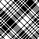
[0 2 1 3]

<b>3</b> 

[0 2 3 1]

<b>4</b> 

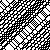
[0 3 1 2]

<b>5</b> 

[0 3 2 1]

<b>6</b> 
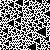

[1 0 2 3]

<b>7</b> 

[1 0 3 2]

<b>8</b> 

[1 2 0 3]

<b>9</b> 

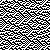
[1 2 3 0]

<b>10</b> 
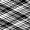

[1 3 0 2]

<b>11</b> 

[1 3 2 0]

<b>12</b> 
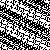

[2 0 1 3]

<b>13</b> 

[2 0 3 1]

<b>14</b> 
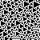

[2 1 0 3]

<b>15</b> 

[2 1 3 0]

<b>16</b> 

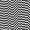
[2 3 0 1]

<b>17</b> 

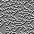
[2 3 1 0]

<b>18</b> 

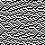
[3 0 1 2]

<b>19</b> 

[3 0 2 1]

<b>20</b> 

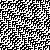
[3 1 0 2]

<b>21</b> 

[3 1 2 0]

<b>22</b> 
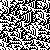

[3 2 0 1]

<b>23</b> 

[3 2 1 0]

Так как соседство Марголуса требует на чётных шагах применять правила, начиная с чётных ячеек, а на нечётных шагах применять правила для нечётных ячеек, я добавил возможность включать и выключать показ нечётных шагов. Некоторые автоматы ведут себя одинаково для чётных шагов, например `0` ~ `23`, `2` ~ `10` ~ `13` ~ `21`. Это можно настраивать здесь: 

<label><input type="checkbox" id="img_intermediate" name="img_intermediate" checked>&nbsp;Показывать нечётные шаги</label>

# Различные свойства

Ещё в данной таблице можно показать различные свойства автоматов. Можете выбирать конкретное свойство и пролистать вверх, автоматы обладающие им, подсветятся красным цветом.

<form name="properties_radio">
<label><input type="radio" name="prop" value="all" checked > Убрать свойства</label> 
<label><input type="radio" name="prop" value="trivial" /> Сохраняют текущее состояние</label> 
<label><input type="radio" name="prop" value="trivial_two" /> Сохраняют через два состояния</label> 
<label><input type="radio" name="prop" value="self_mirror" /> Зеркалирование правил приводит к самому себе</label> 
<label><input type="radio" name="prop" value="save_count" /> Сохраняют количество закрашенных клеток</label> 
<label><input type="radio" name="prop" value="time_symmetricale" /> Одинаковые законы для симуляции назад и вперёд во времени</label> 
<label><input type="radio" name="prop" value="anti_time_symmetricale" /> Правило для симуляции назад во времени равно текущему с инвертированными цветами</label> 
<label><input type="radio" name="prop" value="self_inverse" /> Инвертирование цвета правил приводит к самому себе</label> 
</form>

Все свойства вычисляются для автоматов через 2 шага, то есть после чётного и нечётного хода. Мне кажется оценивать свойства автомата после 1 шага, не зная какой был до этого: чётный или нечётный не очень полезно, потому что вариантов становится слишком много, и свойств практически не остаётся. Некоторые свойства я объясню далее:

Самые скучные автоматы - **сохраняющие текущее состояние**. Это автоматы `0` и `23`. Они не делают ничего.

Чуть менее скучные автоматы — **сохраняющие через два состояния**. Относительно данного шага, их шаг в прошлое и шаг в будущее должны быть одинаковы. В итоге это выливается в то, что они приходят к изначальному состоянию максимум через 4 шага. Тут добавляется ещё два автомата: `7` и `16`.

Ещё чуть менее-скучные автоматы — **при зеркалировании приводящие сами в себя**. То есть они не способны различать где лево, а где право. Тут к тривиальным `0` и `23` добавляются `2 и 21`.

**Одинаковые законы для симуляции назад и вперёд во времени** — мне кажется это свойство аналогично [T-симметрии](https://ru.wikipedia.org/wiki/T-%D1%81%D0%B8%D0%BC%D0%BC%D0%B5%D1%82%D1%80%D0%B8%D1%8F), хотя я не знаю насколько справедливо проводить такие аналогии. К ним относится треугольный `1` и порождаемые им (далее мы увидим это).

**Правило для симуляции назад во времени равно текущему с инвертированными цветами** — то же самое, что и предыдущее, только инвертированное. Это свойство интересно, ведь Криттеры именно такими и являются. То есть если в криттерах инвертировать всё поле, то там будут возникать глайдеры, состоящие не из заполненных клеток, а из пустых клеток, и эти глайдеры будут двигаться назад во времени, а не вперёд.

**Инвертирование цвета правил приводит к самому себе** — тут интересны автоматы `10` и `13`, потому что другими особыми свойствами они не обладают.

Давайте соберём список нетривиальных автоматов, которые обладают своим уникальным свойством:
* `{1, 5, 6, 14}` не различают направление времени.
* `{9, 17, 18, 22}` двигаются назад во времени для инвертированных цветов.
* `{2, 21}` не различают лево и право.
* `{10, 13}` не различают белый и чёрный.

# Красивые автоматы

* `1` похож на правило `30` для обычных автоматов, тоже формирует треугольники, только повёрнутые на 90°.
* `2` похож на узор для рубашки.
* `21` похож на [правило Tron](https://en.wikipedia.org/wiki/Block_cellular_automaton#Tron).

<b>1</b> 

<b>2</b> 

<b>21</b> 

# Порождение правил

Если вернуться в начало и посмотреть на все автоматы, то можно заметить, что для автомата `1`, `5` является его зеркальным отражением, `6` его инверсией, а `14` одновременно инверсией и зеркальным отражением.

<b>1</b> 

<b>5</b> 

<b>6</b> 

<b>14</b> 

Поэтому можно задаться вопросом: а какие автоматы можно вывести из каких при помощи различных операций над правилами?

## Тривиальные порождения

Возьмём преобразования правил, для которых мы можем точно сказать: да, это одно и то же правило, только немного-по другому.
* Поменять местами лево и право. Будет обозначаться Зелёным цветом.
* Инвертировать белый на чёрный. Будет обозначаться Красным цветом.
* Инвертировать правила на симуляцию назад во времени. Будет обозначаться Чёрным цветом.

Тогда все правила будут иметь такие связи:

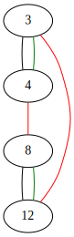

Тут что-то не так. Почему-то `0` и `23` никак не связаны, как не связаны `2` и `21`, а ведь они одинаковы если пропустить нечётные шаги:

<b>0</b> 

<b>23</b> 

<b>2</b> 

<b>21</b> 

Зато автоматы `1`, `5`, `6`, `14` связаны между собой, и это радует:

Значит нам нужно придумать ещё какое-то правило для порождения нового правила, чтобы другие можно было связать.

## Полуинверсия

Давайте добавим правило, которое реализуется полу-инверсией. Если правило можно представить в следующем виде: `[00, 01, 10, 11] → [11, 01, 0, 10]`, то обычная инверсия инвертирует биты с двух сторон, а полу-инверсия только с правой стороны. Будем обозначать её Фиолетовым цветом. Тогда наши графы будут выглядеть следующим образом:

Тут интересная особенность. Кластер правил, порождённых от `1`, связался с кластером правил, порождённых от `22`. Ну и они довольно похожи:

<b>1</b> 

<b>22</b> 

А кластер правил, порождённых от `3`, связался с кластером от `20`. Они выглядят похожим образом при пропуске нечётных шагов:

<b>3</b> 

<b>20</b> 

Если посмотреть на то как новая операция связывает правила, то можно сказать что она просто делает `23-x`. То есть с этой операцией мы можем получить любое правило с `12` включительно, если нам известны все правила до 11. Это хорошо, потому что можно выкинуть половину правил и знать что она будет симметрична первой половине относительно полу-инверсии.

Но у нас всё ещё не связаны правила `2` и `10`, которые просто идентичны без нечётных шагов:

<b>2</b> 

<b>10</b> 

## Странная операция

Я не смог найти комбинацию из обращения времени, отзеркаливания, инверсии, их половинок и всех их комбинаций, чтобы связать `2` и `10` правило. Единственное что я нашёл, это операцию: поменять местами 0 и 1 элемент, и поменять местами 2 и 3 элемент в массиве правила (обозначается квадратными скобками в таблице). Назовём это **странной операцией**, и будем обозначать Циановым цветом

Тогда у нас получается следующий набор графов:

Ура! Теперь у нас связаны тривиальные автоматы `{0, 7, 16, 23}` и чуть более сложные, но тоже очень простые `{2, 10, 13, 21}`. А что касается остальных автоматов, с ними не произошло ничего особенного. Что уже было связано прежними операциями, так и осталось связано ими.

Итого у нас получается 4 группы автоматов, которые можно получить довольно простыми операциями, которые не очень сильно меняют поведение автомата. Можно сказать что если мы изучим свойства автомата `1`, то по идее можем эктраполировать его свойства с учётом полу-инверсии на `22` автомат.

Правда мне эта **странная операция** не нравится совсем. Ведь я не понимаю что будет если её обобщить на:
* Автоматы с большим размером блока (от 3 и больше)
* Автоматы с большим числом цветов (от 3 и больше)
* Автоматы с большей размерностью (от 2 и больше)

Поэтому если у вас есть идеи что с этим можно сделать — пишите.

# 2D время

Следующее исследование свойств вдохновлено статьёй о том как создать 2D время для необратимых клеточных автоматов:
* [CELLULAR AUTOMATA WITH 2 TEMPORAL DIMENSIONS](http://dmishin.blogspot.com/2014/06/cellular-automata-with-2-temporal.html)

Там автор предлагает идею 2D времени, которая требует иметь две функции \\(f, g\\), которые дают одинаковый результат независимо от порядка их применения \\(f(g(x)) = g(f(x))\\). Поэтому можно проверить все автоматы и узнать кто с кем коммутирует. Прежде всего надо сказать что автоматы `{0, 23, 7, 16}` коммутируют со всеми, а они совсем тривиальны и не интересны, поэтому я исключил их из графа. И у меня получился следующим результат:

Тут задействованы правила только из групп, порождённых `2` и `3`, но нет автоматов, порождённых от треугольной `1`, что довольно печально.

Получается примерно тот же результат, как и в той статье, что между собой коммутируют только довольно скучные автоматы, не считая тривиальных.

То что можно рисовать графы между правилами было вдохновлено этой статьёй:
* [GRAPH OF COMMUTING ELEMENTARY CELLULAR AUTOMATA](http://dmishin.blogspot.com/2016/01/graph-of-commuting-elementary-cellular.html)

Для вычисления того коммутируют два правила или нет, я просто беру очень длинную строку на 10к бит, и проверяю формулу `f(g(x)) = g(f(x))` на ней одной. Так что мои результаты не идеальны, но вероятность ошибки крайне мала.

# Исходники

Исходники для вычисления картинок, свойств и графов для этой статьи находятся в репозитории: [optozorax/time_2d_inversible_automata](https://github.com/optozorax/time_2d_inversible_automata).

# Дальнейшая работа

Мне кажется должны найтись очень интересные правила для:
* Обратимых одномерных автоматов с **3** цветами и размером блока **2**
* Обратимых одномерных автоматов с **2** цветами и размером блока **3**

В первом случае получается 3²! = 362_880, а во втором 2³! = 40_320 автоматов, что тоже очень много...

Тут придётся уже писать софт, чтобы в графах искать компоненты связности. И больше раскидывать мозгами. Но думаю что количество групп, из которых можно вывести всё остальное, должно быть не таким большим. А далее уже можно исследовать группы на коммутативность. Может среди этих вариантов найдутся интересные правила, для которых можно образовать двумерное время.

